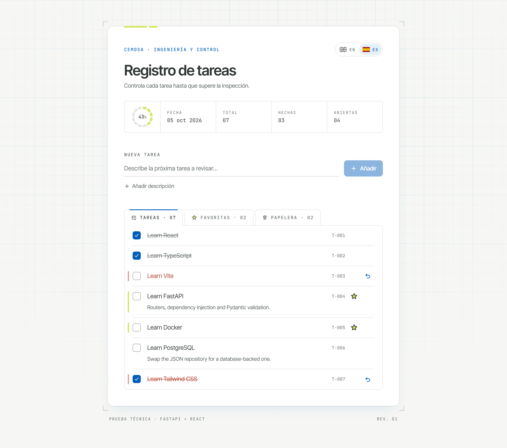
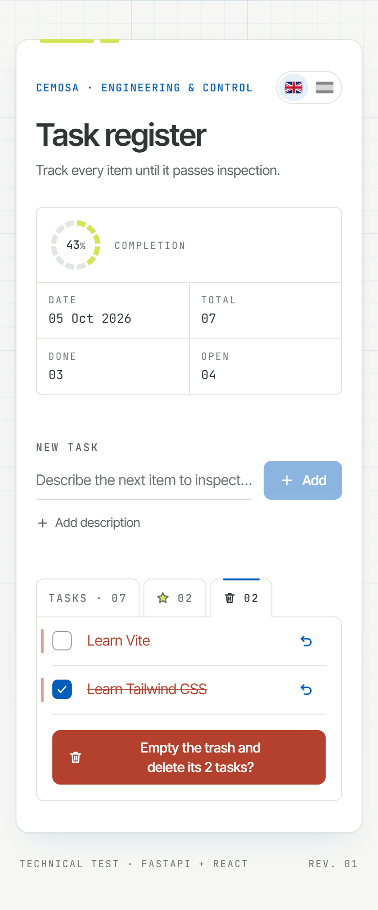

<p align="right"><a href="README.md">English</a> · <b>Español</b></p>

# Registro de tareas — prueba técnica CEMOSA

Aplicación de tareas construida con **FastAPI** y **React + TypeScript (Vite)**, diseñada como una
hoja de control de calidad sobre papel técnico, en línea con el trabajo de CEMOSA en ingeniería y
control de calidad. Cubre todas las tareas de [`INSTRUCTIONS.md`](INSTRUCTIONS.md), con interfaz
bilingüe (español / inglés) y tests automáticos en ambas partes.

<p align="center">
  
  &nbsp;
  
</p>

## Funcionalidades

| Tarea del enunciado | Implementación |
|---|---|
| 1. Estado de completado guardado en el backend | `PATCH /todos/{id}`; el checkbox cambia al instante y vuelve atrás si falla el guardado |
| 2. Borrar tareas | Una papelera: el botón de la papelera envía allí la tarea (se muestra en rojo, con un botón para restaurarla) y no se pierde nada hasta vaciarla. Al vaciarla se borran todas sus tareas con una sola petición, `DELETE /todos?ids=…` |
| 3. Carga automática de tareas | La lista se carga al abrir la página y se recarga tras cada alta, completado, cambio de favorita o de papelera y al vaciar la papelera |
| 4. Descripciones y favoritas | Descripción opcional (hasta 500 caracteres) y botón de estrella; las favoritas tienen su propia pestaña, junto a la lista completa, donde mantienen la estrella encendida |
| 5. README | Este archivo, en español y en [inglés](README.md) |

Además de lo que pide el enunciado:

- Interfaz en **inglés / español** con selector de idioma por banderas; arranca en inglés y recuerda la elección.
- **Almacenamiento robusto**: repositorio JSON seguro ante peticiones simultáneas, con escrituras
  atómicas, migración automática del archivo de datos original e ids que nunca se reutilizan tras
  un borrado.
- **Accesibilidad**: HTML semántico, uso completo con teclado, foco visible, avisos para lectores
  de pantalla, contraste WCAG AA y respeto a la preferencia de *reducir movimiento*.
- **Pestañas que aparecen cuando hacen falta**: Favoritas y Papelera quedan plegadas detrás de la
  pestaña anterior mientras están vacías, y se despliegan con su primera tarea.
- **Tests**: 69 tests de backend (pytest) y 59 de frontend (Vitest + Testing Library).

## Puesta en marcha

### Requisitos

- **Python 3.11–3.13**. Python 3.14 todavía no es compatible: la versión fijada de `pydantic-core`
  no tiene paquetes precompilados para él.
- **Node.js 22 LTS** y npm. El proyecto se ha desarrollado y probado con Node 22; con versiones
  anteriores puede fallar la instalación o el arranque.

### 1. Backend

```bash
cd backend
python -m venv .venv
# Windows: .venv\Scripts\activate    macOS/Linux: source .venv/bin/activate
pip install -r requirements-dev.txt   # o requirements.txt para omitir las herramientas de test
```

### 2. Frontend

```bash
cd frontend
npm install
```

### 3. Arrancar

```bash
cd frontend
npm run dev
```

Arranca los dos servidores. El backend se ejecuta automáticamente desde `backend/.venv`, sin
necesidad de activarlo.

| | URL |
|---|---|
| Aplicación | http://localhost:5173 |
| API | http://localhost:8000 |
| Documentación interactiva de la API | http://localhost:8000/docs |

También se pueden arrancar por separado: `npm run dev:frontend` y `npm run dev:backend`, o
`python -m uvicorn app.main:app --reload` desde `backend/`.

### Configuración

Todos los ajustes son opcionales.

| Variable | Dónde | Por defecto | Para qué |
|---|---|---|---|
| `VITE_API_URL` | frontend (`.env.local`, ver `.env.example`) | `http://localhost:8000` | URL base del backend |
| `API_PORT` | `npm run dev` / `dev:backend` | `8000` | Puerto del backend |
| `TODO_DATA_FILE` | backend | `backend/app/todos.json` | Archivo JSON donde se guardan las tareas |
| `TODO_CORS_ORIGINS` | backend | `*` | Orígenes permitidos, separados por comas |

## Tests

```bash
# Backend
cd backend
python -m pytest

# Frontend
cd frontend
npm test          # npm run test:watch mientras se desarrolla
npm run lint
npm run build     # comprueba también los tipos del código, incluidos los tests
```

- Los **tests del backend** recorren la API HTTP y el repositorio JSON. Cubren la validación, los
  códigos de error, CORS, las migraciones de datos y las escrituras simultáneas. Cada test usa su
  propio archivo de datos temporal.
- Los **tests del frontend** usan la aplicación completa como lo haría una persona, contra una API
  falsa en memoria. Cubren cada tarea del enunciado, además de la gestión de errores, las vueltas
  atrás, la papelera y el selector de idioma. El cliente HTTP, el hook con el estado de la lista,
  los mensajes de error, la detección del idioma y el formulario tienen también tests unitarios.

## API

| Método | Ruta | Cuerpo | Respuestas |
|---|---|---|---|
| `GET` | `/todos` | — | `200` lista de tareas |
| `POST` | `/todos` | `{ title, description?, completed?, favorite? }` | `201` tarea · `422` datos no válidos |
| `PATCH` | `/todos/{id}` | Cualquier combinación de `title`, `description`, `completed`, `favorite`, `trashed` | `200` tarea · `404` · `422` |
| `DELETE` | `/todos/{id}` | — | `204` · `404` |
| `DELETE` | `/todos?ids=1&ids=2` | — | `204` · `422` |

```json
{ "id": 4, "title": "Learn FastAPI", "description": "Routers and validation", "completed": false, "favorite": true, "trashed": false }
```

- Los títulos se guardan sin espacios en los extremos y deben tener entre 1 y 120 caracteres. La
  descripción es opcional, de hasta 500 caracteres, y si está vacía se guarda como `null`.
- `PATCH` solo cambia los campos que se envían. Se rechazan el cuerpo vacío, los campos
  desconocidos y `null` en un campo obligatorio; `"description": null` borra la descripción.
- `trashed` mete y saca una tarea de la papelera sin tocar sus demás campos, así que al restaurarla
  vuelve exactamente como estaba. No se puede crear una tarea directamente en la papelera.
- `DELETE /todos?ids=…` borra de 1 a 1000 tareas en una sola petición y una sola escritura del
  archivo. Los ids que ya no existen se ignoran, así que repetirla o coincidir con otro cliente
  nunca falla.
- Si el archivo de datos no se puede leer, la API responde `500` con un mensaje claro en lugar de
  fallar sin control.

## Estructura del proyecto

```
backend/
  app/
    main.py                  # Fábrica de la aplicación: configuración, CORS, errores y rutas
    core/                    # Configuración (variables de entorno) y errores de dominio → códigos HTTP
    schemas/todo.py          # Modelos Pydantic: TodoCreate, TodoUpdate (parcial), Todo
    repositories/            # Interfaz TodoRepository + implementación JSON
    api/                     # Inyección de dependencias y router /todos
    todos.json               # Datos
  tests/                     # Tests con pytest
frontend/
  scripts/dev-backend.mjs    # Arranca uvicorn desde el entorno virtual en cualquier sistema
  src/
    api/                     # Cliente HTTP (ApiError) y todosApi
    hooks/useTodos.ts        # Estado y acciones de la lista: carga, recargas, vueltas atrás
    i18n/                    # Proveedor de idioma, detección y diccionarios ES/EN
    components/
      layout/                # Hoja, cabecera, cajetín, anillo de progreso
      todo/                  # Formulario, lista, fila, controles de favorita y papelera
      ui/                    # Botón, checkbox, pestañas, iconos, banderas, aviso de error, estado vacío
    test/                    # Configuración de tests y API falsa en memoria
    index.css                # Tokens de diseño (Tailwind v4 @theme) y animaciones
```

## Decisiones de diseño

### Backend

- **Arquitectura en capas con el patrón repositorio.** Las rutas dependen de la interfaz
  `TodoRepository`, no del archivo JSON. Pasar a SQLite o PostgreSQL consiste en añadir una clase,
  sin tocar las rutas ni los esquemas.
- **Almacenamiento JSON seguro.** Cada ciclo de leer, modificar y escribir se ejecuta con un
  bloqueo, porque FastAPI atiende los endpoints síncronos en varios hilos. Se escribe en un archivo
  temporal que después sustituye al original, así que una escritura interrumpida no puede
  corromper los datos.
- **Los ids nunca se reutilizan.** El archivo guarda un contador `next_id`, de modo que un cliente
  desactualizado que actúe sobre una tarea borrada recibe un `404` en lugar de modificar otra más
  reciente.
- **Compatible con los datos anteriores.** El archivo original (una lista sin ids) y los registros
  sin los campos nuevos se migran automáticamente la primera vez que se leen.

### Frontend

- **Un único sitio para los datos.** Todas las peticiones pasan por `api/client.ts` y todo el
  estado de la lista vive en `useTodos`. Cada acción se ejecuta a través de una sola función que
  después recarga la lista, así que ninguna acción nueva puede olvidarse de hacerlo.
- **Respuesta inmediata.** Completar, marcar como favorita, enviar a la papelera y vaciarla
  actualizan la pantalla al momento y se deshacen si la petición falla. Antes de cada acción se cancelan las recargas en
  curso, para que unos datos desfasados nunca pisen el cambio que se ve en pantalla.
- **Traducciones comprobadas por el compilador.** El diccionario en español está tipado contra el
  inglés: si falta una clave o sobra alguna, el proyecto no compila. Los mensajes del backend nunca
  se muestran tal cual; los errores se traducen a mensajes propios.
- **Identidad visual.** Los colores corporativos están tomados del logotipo de CEMOSA (azul
  `#005DB9`, lima `#D4E458`, gris `#2F3734`). Los detalles se inspiran en los planos técnicos:
  cuadrícula de fondo, marcas de corte, cajetín, códigos de referencia `T-007` y un anillo de
  progreso segmentado que recuerda al logotipo. Todos los colores son tokens de diseño; no hay
  códigos de color sueltos en los componentes.
- **Una papelera en lugar de una confirmación.** Borrar las tareas una a una pedía confirmación;
  enviarlas a la papelera no la necesita, porque se pueden restaurar. La única acción irreversible
  que queda es vaciar la papelera, con su propio botón de texto inequívoco.
- **Movimiento sereno y coherente.** Una escala de tiempos común (200 / 320 / 450 ms, y 550 ms
  para cambiar de vista). Las filas abren y cierran su altura para que la lista nunca dé saltos,
  las pestañas se despliegan desde detrás de las otras y todo pasa a ser instantáneo cuando el
  sistema pide reducir el movimiento.

## Posibles siguientes pasos

- Un repositorio con base de datos (SQLite/PostgreSQL) seleccionable por configuración.
- Editar en línea el título y la descripción de una tarea (la API ya lo permite).
- Autenticación y listas por usuario.
- Filtros y búsqueda cuando las listas crezcan.
- Integración continua que ejecute los tests en cada pull request.
